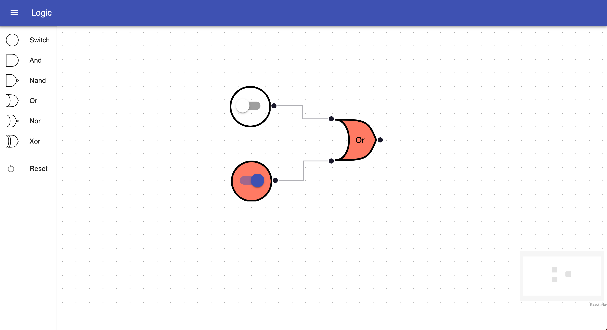
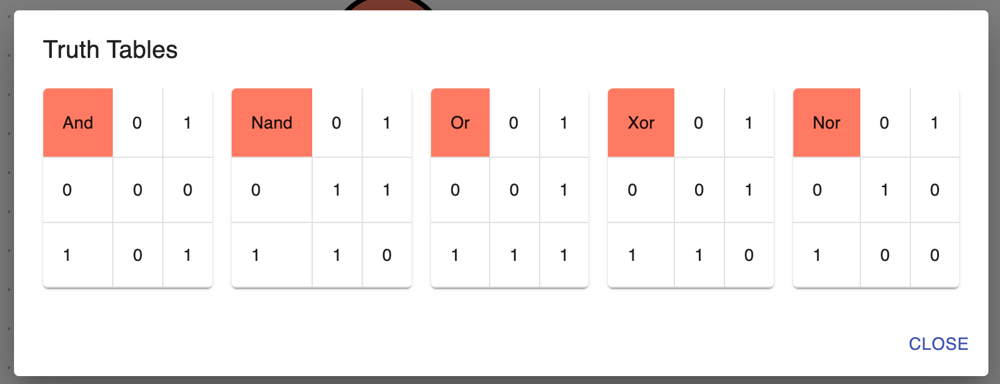

# react-logic
Play with logic gates

This app is built with React, Material-ui, and ReactFlow.  Just drag gates from
the Drawer onto the board, and connect them.  Switches provide a toggle to turn
them on and off.

## Truth Tables
You can view the truth tables that this app uses by clicking the button in the drawer.

